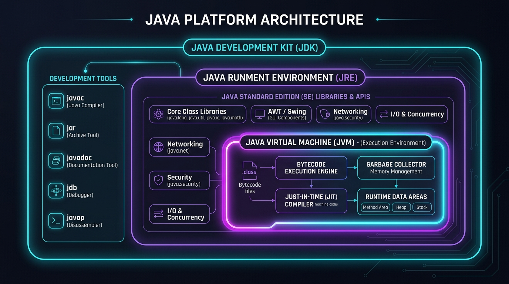
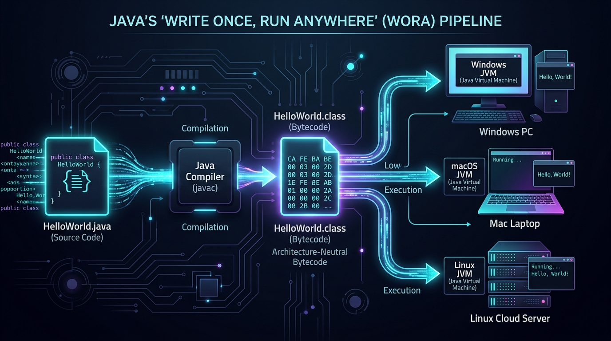
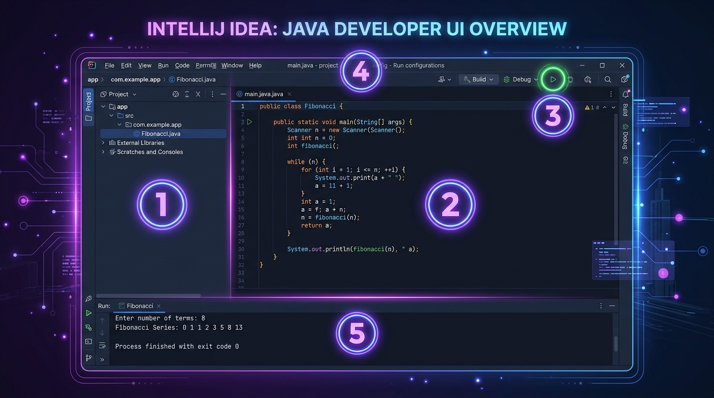
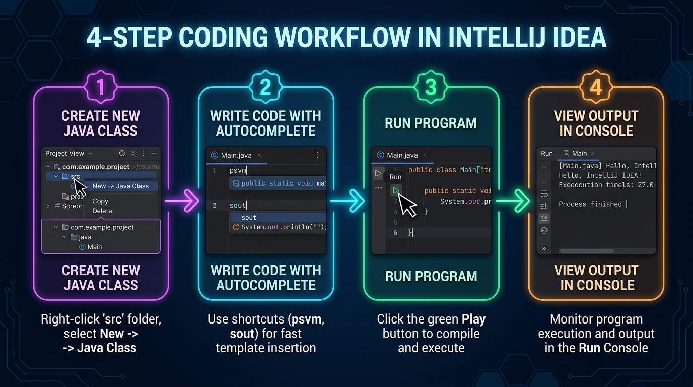

# Session 1: Introduction to Java & Core Architecture ☕

> **Module:** JAVA-I-TL1 | **Duration:** 2 Hours | **Aptech Certified Courseware (2026)**  
> **Prerequisites:** None. Zero programming knowledge assumed.

---

## 🧠 Memory Booster: Fundamental Computing Refreshers
Before writing your first Java program, keep these three physical reality checks in mind:
- **Hardware vs. Software:** Hardware is the physical engine (CPU, screen, chips). Software is the immaterial instructions telling the engine what to compute.
- **RAM (Memory) vs. Storage (Disk):** Hard drives (SSDs) store files permanently when powered off. **RAM** is the computer's scratchpad—code only executes when loaded into RAM!
- **Binary & High-Level Code:** Processors only switch between 0 and 1. Java allows humans to write English-like commands that developer tools turn into binary.

---

## 1. What is Programming?

Think of a computer as an extraordinarily fast, obedient assistant who has **zero common sense**. A computer cannot guess what you meant; it only does exactly what you instruct it to do, step by step.

### Real-World Analogy: The Robot Peanut Butter Sandwich
- If you tell a human: *"Make a peanut butter sandwich,"* they instinctively open the bread bag, take two slices, unscrew the jar lid, and spread peanut butter with a knife.
- If you tell a computer robot without detailed instructions, it will crash or smash the unopened glass jar onto the kitchen counter. It needs every micro-step specified:
  1. Open bread bag
  2. Extract slice #1 and slice #2
  3. Rotate jar lid counter-clockwise until opened
  4. Dip knife blade 2 inches into peanut butter
  5. Spread evenly across bread surface

**Programming** is writing that exact, unambiguous sequence of steps. Because computers only process electrical pulses (binary 0s and 1s), we write code in a high-level language like **Java**, which software tools translate into computer execution.

---

## 2. Structured (Procedural) Programming Paradigm

In the early decades of computing (1960s–1980s), programs used the **Structured Programming Paradigm** (e.g., C, Pascal, BASIC).

### Key Characteristics:
- **Procedure / Algorithm First**: Focuses on *verbs* (actions and functions).
- **Data is Separate**: Global variables store numbers and text; functions reach into variables, manipulate them, and return results.
- **Control Flow**: Uses sequential statements, decisions (`if/else`), and loops (`for/while`), eliminating unstructured `GOTO` jumps.

### Major Limitation: The Global Data Problem
When programs expand to hundreds of thousands of lines, functions across different files share and modify common data. If one developer accidentally modifies a global variable, the entire program can corrupt without warning.

---

## 3. Object-Oriented Programming (OOP) Paradigm

To solve the chaos of large structured systems, computer scientists invented **Object-Oriented Programming (OOP)**. Java is built from the ground up around OOP.

### Intuition: What is an Object?
Look around you: your smartphone, a coffee mug, your car, your student ID card—all of these are real-world **objects**.

Every object possesses two core qualities:
1. **State (Attributes / Data):** What the object *has* (e.g., Car: `color = "Red"`, `fuel = 85%`, `speed = 0`).
2. **Behavior (Methods / Functions):** What the object *does* (e.g., Car: `accelerate()`, `brake()`, `refuel()`).

### Comparison Table

| Aspect | Structured Programming | Object-Oriented Programming (Java) |
| :--- | :--- | :--- |
| **Primary Unit** | Function / Procedure | Class & Object |
| **Data Protection** | Weak; data is exposed | High; encapsulated inside objects |
| **Real-world Mapping**| Hard to map directly | Direct: Customer, Order, BankAccount |
| **Reusability** | Copy-pasting functions | Inheritance, Polymorphism, Packages |

---

## 4. The Java Platform: JVM, JRE, and JDK

Java was created in 1995 by **James Gosling** at Sun Microsystems with a revolutionary design: programs do not compile directly into operating system machine code. Instead, they compile into **Bytecode**.


*Figure 1.1: Java Platform Architecture — Nested relationship of JDK, JRE, and JVM.*

### The Russian Nesting Dolls: `JDK > JRE > JVM`

1. **JVM (Java Virtual Machine)**:
   - The virtual software engine that loads and executes compiled `.class` bytecode.
   - Converts bytecode into your computer's specific CPU machine code using the **Just-In-Time (JIT)** compiler.
2. **JRE (Java Runtime Environment)**:
   - Contains the **JVM + Standard Class Libraries** (math, networking, collections, graphics).
   - Designed for end-users who only need to run existing Java software.
3. **JDK (Java Development Kit)**:
   - Contains **JRE + JVM + Developer Tools**:
     - `javac`: The Java Compiler
     - `java`: The Java Application Launcher
     - `jar`: Archiving and packaging tool
     - `jdb`: Command-line debugger
   - Designed for software engineers writing code.

---

## 5. Write Once, Run Anywhere (WORA)

In languages like C or C++, a binary compiled on Windows will not execute on a Mac. In Java:
- You write code on Windows: `HelloWorld.java`
- You compile it: `javac HelloWorld.java` &rarr; `HelloWorld.class`
- You copy `HelloWorld.class` to a Mac or a Linux cloud server. It runs immediately via `java HelloWorld` without touching the code!


*Figure 1.2: Java's WORA Pipeline — Source code compiling into universal Bytecode and running across all OS platforms.*

> **Fun Fact:** Every compiled Java `.class` file starts with the 4-byte magic signature `0xCAFEBABE` in its binary header!

---

## 6. Downloading & Installing the JDK

1. Download an enterprise-grade distribution: **Eclipse Temurin** (via [Adoptium.net](https://adoptium.net/)) or **Oracle OpenJDK**.
2. Run the installer and enable **"Set JAVA_HOME"** and **"Add to PATH"**.
3. Open a fresh terminal (PowerShell / Command Prompt) and verify:
   ```bash
   javac -version
   java -version
   ```
   Both commands should display valid version strings (e.g. `javac 25.x` — JDK 25 LTS is the course standard; 17 or higher works).

---

## 7. IntelliJ IDEA: Your Development Cockpit

While you can write code in a basic text editor and compile it from the command line, modern Java engineering happens inside an **Integrated Development Environment (IDE)**. In this course, we use **IntelliJ IDEA**.


*Figure 1.3: IntelliJ IDEA Cockpit Map — 1. Project Files, 2. Code Editor, 3. Gutter Run Buttons, 4. Top Run Toolbar, 5. Bottom Run Console.*

> 💡 **Visual Guide:** For a comprehensive breakdown of laptop file paths, IntelliJ interface zones, debugging, and shortcuts, read the [IntelliJ IDEA & Laptop Navigation Guide](../../intellij-guide.html).

### The 4-Step IntelliJ IDEA Workflow


*Figure 1.4: 4-Step Coding Workflow in IntelliJ IDEA.*

1. **Create Class:** Right-click the `src` folder in the Project window &rarr; **New** &rarr; **Java Class** &rarr; Name it `HelloWorld`.
2. **Fast Boilerplate:** Inside the class, type `psvm` and press <kbd>Tab</kbd> to generate `public static void main`, then type `sout` and press <kbd>Tab</kbd> to generate `System.out.println()`.
3. **Run Code:** Click the green play button **▶** in the left gutter next to `main`, or press <kbd>Ctrl + Shift + F10</kbd> (<kbd>Ctrl + Shift + R</kbd> on macOS).
4. **View Output:** The bottom Run Console window opens automatically, displaying the program output and `Process finished with exit code 0`.

---

## 8. Dissecting Your First Program: `HelloWorld.java`

```java
public class HelloWorld {
    public static void main(String[] args) {
        System.out.println("Hello, World! Welcome to Java Programming.");
    }
}
```

### Step-by-Step Execution

**Option A (Inside IntelliJ IDEA):** Click the green play button **▶** in the gutter next to line 2.
**Option B (Via Terminal / CLI):**
```bash
# 1. Compile source into bytecode
javac HelloWorld.java

# 2. Run the compiled class file
java HelloWorld
```

### Line-by-Line Token Breakdown

| Token | Explanation |
| :--- | :--- |
| `public` | Access modifier: Visible to the entire runtime environment and JVM. |
| `class` | Keyword indicating that we are defining a new class blueprint. |
| `HelloWorld` | The identifier name of the class; **must** match the filename `HelloWorld.java`. |
| `{ ... }` | Code blocks defining boundaries of classes and methods. |
| `static` | Allows the JVM to invoke this method directly without instantiating an object first. |
| `void` | Return type: This method performs its task and returns no value. |
| `main` | The mandatory entry point name recognized by the JVM. |
| `String[] args`| An array of textual arguments provided from the command line upon launch. |
| `System.out.println()` | Built-in output statement that writes text to the console followed by a newline. |
| `;` | Statement terminator; required after every standalone executable instruction. |

---

## 9. Top 3 Beginner Traps & How to Fix Them

1. **Case Sensitivity**: Java treats `System` and `system` as completely different names. Always watch your capitalization!
2. **File Name Mismatch**: A public class named `HelloWorld` must be saved in a file named `HelloWorld.java`.
3. **Running with `.class`**:
   - Correct: `java HelloWorld`
   - Incorrect: `java HelloWorld.class` (will cause `ClassNotFoundException`!)

---

## 10. Executive Quick-Recap & Cheat Sheet

### ⚡ The 30-Second Mental Model
You write source code in a `.java` file. `javac` compiles it into platform-independent `.class` Bytecode. When launched via `java`, the host system's native JVM executes that bytecode starting inside `main()`.

### Core Syntax at a Glance
```java
public class MyFirstProgram {
    public static void main(String[] args) {
        System.out.println("Prints text with a newline");
        System.out.print("Prints text without a newline");
    }
}
```

### Plain-English Vocabulary Glossary
- **JVM**: The runtime virtual machine executing bytecode on your local CPU.
- **JDK**: The software development kit containing `javac`, runtime, and libraries.
- **Bytecode**: Intermediate universal binary instructions stored in `.class` files.
- **WORA**: "Write Once, Run Anywhere" — write code once, runs on Windows, Mac, Linux.
- **Encapsulation**: Grouping data and methods into protective objects to prevent unauthorized tampering.

### Self-Check Questions
1. *Why can't the JVM execute a `.java` file directly?*
   **Answer:** The JVM only understands Bytecode (`.class` files), not human source code. `javac` must translate it first.
2. *What happens if you save `public class App` in `Main.java`?*
   **Answer:** A compilation error occurs because public classes must match their filename exactly.
3. *What is the difference between `System.out.print` and `System.out.println`?*
   **Answer:** `print` leaves the cursor on the same line, while `println` automatically advances to the next line.

