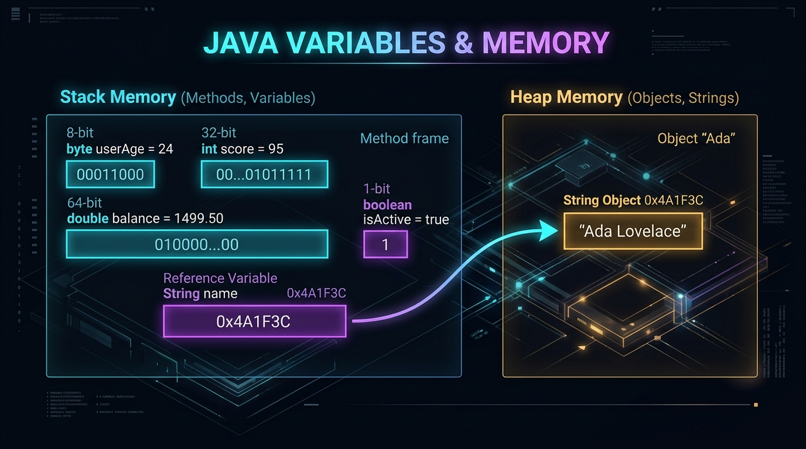
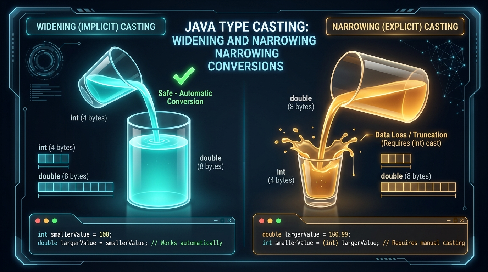

# Session 2: Variables, Data Types, and Operators 📦

> **Module:** JAVA-I-TL2 | **Duration:** 2 Hours | **Aptech Certified Courseware (2026)**  
> **Prerequisites:** Session 1 (JDK Setup, First Program)

---

## 🧠 Memory Booster: Flashback to Session 1
Before diving into variables and math, connect today's concepts with Session 1:
- **Code Container:** All variable calculations execute inside `public static void main(String[] args)`.
- **Compiler Safety:** Typos in variable types are caught by `javac` before bytecode is ever created.
- **RAM Volatility:** Variables reside in temporary RAM; as soon as `main()` finishes, the memory slots are released.

---

## 1. Variables: Memory with a Name

A **variable** is a named location in the computer's Random Access Memory (RAM) reserved to hold a value.

```java
// Syntax: DataType variableName = initialValue;
int studentAge = 22;
double courseRating = 4.95;
boolean isGraduated = false;
String trackName = "AI-Driven Java Programming";
```

### Naming Rules & Conventions
- **Allowed Characters**: English letters, numbers (`0-9`), underscores (`_`), dollar signs (`$`).
- **Cannot Start with a Digit**: `player1` is valid; `1player` is illegal.
- **No Reserved Keywords**: You cannot name a variable `class`, `public`, `int`, etc.
- **Convention**: Use **camelCase** for variables and methods (`accountBalance`, `userEmailAddress`). Class names use **PascalCase** (`StudentTracker`).

---

## 2. The 8 Java Primitive Data Types

| Type | Bits | Value Range | Default | Common Purpose |
| :--- | :--- | :--- | :--- | :--- |
| `byte` | 8 | -128 to 127 | 0 | Raw binary streams, low-memory buffers |
| `short`| 16 | -32,768 to 32,767 | 0 | Legacy audio/sensor data |
| `int` | 32 | -2.14B to +2.14B | 0 | **Standard integer for whole numbers** |
| `long` | 64 | -9 Quintillion to +9 Quintillion | 0L | Timestamps, large databases (needs `L` suffix) |
| `float`| 32 | ~6-7 decimal places | 0.0f | Graphics pipelines, 3D math (needs `f` suffix) |
| `double`| 64| ~15-16 decimal places | 0.0d | **Standard type for decimal numbers** |
| `char` | 16 | Single Unicode character | '\u0000'| Single letters, symbols in single quotes (`'A'`) |
| `boolean`| 1 | `true` or `false` | `false`| Conditional logic and flags |


*Figure 2.1: Java Variables & Memory Layout — Stack Memory (primitives) vs Heap Memory (reference objects).*

---

## 3. Reference Types vs. Primitive Types (String)

- **Primitive variables** store their raw value directly inside the variable container.
- **Reference types** store memory addresses pointing to objects on the heap.
- `String` is a reference class:
  ```java
  String greeting = "Hello";
  String name = "Ada";
  String message = greeting + ", " + name + "!"; // Concatenation
  ```

---

## 4. Escape Sequences & Formatted Output (`printf`)

### Escape Sequences
- `\n` : Newline
- `\t` : Tab space
- `\"` : Double quotation mark
- `\\` : Literal backslash

### Formatted Output (`System.out.printf`)
```java
String product = "Cloud Server";
double price = 149.998;
int count = 5;

// %-15s = Left align string in 15 chars
// %10d  = Right align int in 10 chars
// %10.2f= Right align float with 2 decimal places
System.out.printf("%-15s %10d $%10.2f%n", product, count, price);
```

---

## 5. Operators in Java

### 1. Arithmetic Operators
- `+` (Addition), `-` (Subtraction), `*` (Multiplication)
- `/` (Division): **Warning!** `7 / 2 = 3` (integer division truncates!). Use `7.0 / 2 = 3.5`.
- `%` (Modulus): Returns remainder (`17 % 5 = 2`).

### 2. Relational & Logical Operators
- Relational: `==`, `!=`, `<`, `>`, `<=`, `>=`
- Logical:
  - `&&` (AND): Both conditions must be true.
  - `||` (OR): At least one condition must be true.
  - `!` (NOT): Reverses boolean state.

### 3. Ternary Operator
```java
int score = 75;
String result = (score >= 50) ? "PASS" : "FAIL";
```

---

## 6. Type Casting: Widening vs. Narrowing

### Widening (Implicit / Automatic)
- Moving from a smaller data type to a larger data type is always safe:
  ```java
  int count = 100;
  double bigNumber = count; // Automatically becomes 100.0 (Safe)
  ```

### Narrowing (Explicit / Manual)
- Moving from a larger data type to a smaller data type requires explicit casting:
  ```java
  double price = 99.85;
  int roundedPrice = (int) price; // Truncates .85 -> result is 99!
  ```


*Figure 2.2: Liquid Container Metaphor — Safe widening vs. narrowing with overflow/data loss.*

---

## 7. Executive Quick-Recap & Cheat Sheet

### ⚡ The 30-Second Mental Model
Primitives store values directly in stack RAM. References store memory addresses pointing to objects on the heap. Widening casting is automatic; narrowing casting chops off decimals and requires `(targetType)`.

### Core Syntax at a Glance
```java
int qty = 4;
double rate = 25.50;
long timestamp = 1788000000L;
float tax = 0.05f;
char code = 'C';
boolean active = true;

// Currency format
System.out.printf("Total: $%.2f%n", (qty * rate));
```

### Plain-English Vocabulary Glossary
- **Primitive**: Built-in simple data types holding raw values in RAM (8 types).
- **Reference**: A variable holding a pointer to an object on the heap (like String).
- **Truncation**: Chopping off decimals during integer division or narrowing casting without rounding.
- **Literal Suffix**: The trailing `L` or `f` telling Java to treat numbers as long or float.
- **Modulus (%)**: Operator that calculates the remainder after division.

### Self-Check Questions
1. *Why does `int x = 9 / 2;` equal 4 instead of 4.5?*
   **Answer:** Integer division always truncates decimals. To get 4.5, write `9.0 / 2`.
2. *What suffix is needed for float and long literals?*
   **Answer:** `f` (e.g. `9.99f`) for float, and `L` (e.g. `1000000000L`) for long.
3. *Does `(int) 8.95` round up to 9?*
   **Answer:** No, narrowing casting discards the `.95`, leaving `8`.

