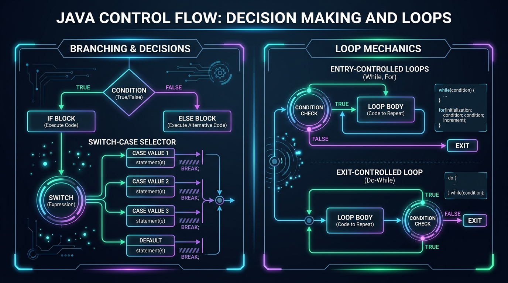

# Session 3: Decision-Making Constructs and Loops 🔀

> **Module:** JAVA-I-TL3 | **Duration:** 2 Hours | **Aptech Certified Courseware (2026)**  
> **Prerequisites:** Session 2 (Variables, Data Types & Operators)

---

## 🧠 Memory Booster: Flashback to Session 2 Logic
Before writing branching and looping code, connect today's logic with Session 2:
- **Boolean Power:** Every decision in Java comes down to a boolean expression (`true` or `false`) produced by relational operators (`>`, `<`, `==`, `!=`).
- **Logical Connectors:** Use `&&` (AND) when all conditions must hold, and `||` (OR) when any condition suffices.
- **String Comparison:** Always compare text with `.equals()`, not `==`! `name.equals("Alice")` compares the characters; `name == "Alice"` compares memory addresses.

---

## 1. The Power of Control Flow

In computing, **Control Flow** refers to the order in which statements are evaluated. Java provides:
- **Decision-Making (Branching)**: `if`, `if-else`, `if-else-if`, `nested if`, `switch-case`
- **Loops (Iteration)**: `for`, `while`, `do-while`
- **Jump Statements**: `break`, `continue`


*Figure 3.1: Java Control Flow Architecture — Branching decisions and loop cycle mechanics.*

---

## 2. Decision-Making: `if` Statements

```java
// 1. Simple if
if (score >= 50) {
    System.out.println("Passed");
}

// 2. if - else
if (isMember) {
    discount = 0.15;
} else {
    discount = 0.0;
}

// 3. if - else if - else ladder
if (gpa >= 3.5) {
    status = "First Class";
} else if (gpa >= 3.0) {
    status = "Second Class Upper";
} else {
    status = "General Standing";
}
```

---

## 3. The `switch-case` Statement

Best suited for evaluating a single variable against discrete constants:

```java
String courseCode = "JAVA-I";

switch (courseCode) {
    case "JAVA-I":
        System.out.println("AI-Driven Java Programming");
        break; // Crucial: prevents fall-through!
    case "PY-I":
        System.out.println("Python for AI & Data Science");
        break;
    default:
        System.out.println("Elective / General Study");
        break;
}
```

### Supported Types in `switch`:
`byte`, `short`, `char`, `int`, `String`, and `enum`. *(No floats, doubles, or booleans!)*

---

## 4. Loops: `while`, `do-while`, and `for`

| Loop Type | Classification | When to Use | Syntax Summary |
| :--- | :--- | :--- | :--- |
| `for` | Entry-Controlled | Iterations count is known in advance | `for (init; cond; update) { ... }` |
| `while` | Entry-Controlled | Iterations depend on a changing condition | `while (cond) { ... }` |
| `do-while` | Exit-Controlled | Body must execute at least once (e.g. interactive menu) | `do { ... } while (cond);` |

---

## 5. Jump Statements

- `break`: Aborts the loop or switch entirely.
- `continue`: Skips the remainder of the current loop iteration and moves to the next.

---

## 6. Executive Quick-Recap & Cheat Sheet

### ⚡ The 30-Second Mental Model
Branching chooses *which* path of code to take. Looping chooses *how many times* to repeat a path. Entry-controlled loops (`for`/`while`) test first; exit-controlled loops (`do-while`) test after executing once.

### Core Syntax at a Glance
```java
// Branching
if (x > 0) { ... } else { ... }

// switch
switch (choice) { case 1: break; default: break; }

// Count-controlled loop
for (int i = 0; i < 10; i++) { ... }

// Jumps
if (found) break; // exit immediately
if (skipThis) continue; // skip to next lap
```

### Plain-English Vocabulary Glossary
- **Branching**: Choosing an alternative execution path based on boolean true/false.
- **Fall-Through**: Omitting `break;` in a switch statement, causing subsequent cases to execute uncontrollably.
- **Entry-Controlled**: Testing condition before the loop body runs (can execute 0 times).
- **Exit-Controlled**: Testing condition after the loop body runs (guaranteed to execute at least 1 time).
- **Infinite Loop**: A loop condition that never becomes false, freezing the application.

### Self-Check Questions
1. *Why can't `double` or `float` be used inside a switch statement?*
   **Answer:** Floating-point rounding inaccuracies can cause unexpected equality mismatches.
2. *What is the minimum number of times a `do-while` loop executes?*
   **Answer:** At least 1 time, because its condition check is located at the exit.
3. *What does `continue` do inside a for loop?*
   **Answer:** It skips the rest of the current iteration body and jumps directly to the update step (`i++`).

