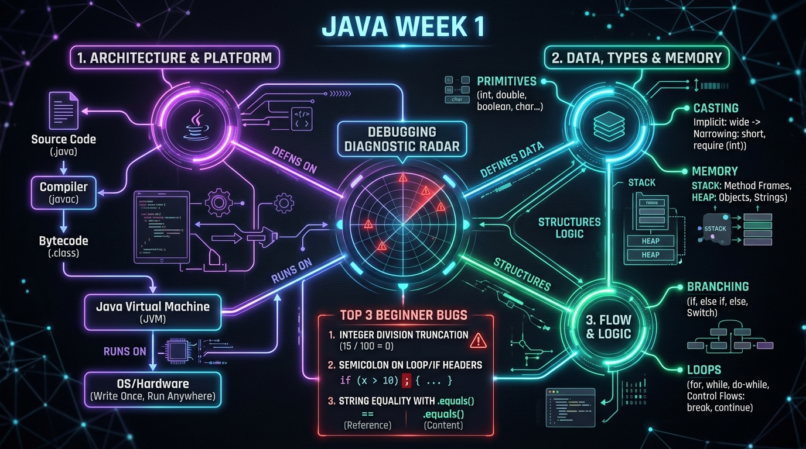

# Session 4: Try It Yourself & Week 1 Consolidation 🔄

> **Module:** JAVA-I-TL4 | **Duration:** 2 Hours | **Aptech Certified Courseware (2026)**  
> **Coverage:** Comprehensive Review & Debugging of Sessions 1 to 3

---

## 🧠 Memory Booster: The 3 Pillars of Week 1
Before entering today's consolidation lab, recall how all 3 sessions connect:
- **Pillar 1 (Platform):** `javac` turns human code into `.class` Bytecode executed on any platform by the JVM.
- **Pillar 2 (Data):** Variables store state in RAM—primitives in stack frames, reference objects in the heap.
- **Pillar 3 (Flow):** Branching (`if/else`, `switch`) selects paths, and loops (`for`, `while`, `do-while`) repeat instructions.

---

## 1. Week 1 Architecture & Mindmap
```text
Source Code (.java) -> javac -> Bytecode (.class) -> JVM -> CPU Execution
```


*Figure 4.1: Java Week 1 Architecture & Debugging Radar — Connecting Platform, Data, Flow, and Debugging Traps.*

- **Session 1**: Structure of a class, `main` method, JDK vs JRE vs JVM, WORA.
- **Session 2**: 8 primitive types, type casting, arithmetic precedence, `printf` formatting.
- **Session 3**: `if/else`, `switch`, `while`, `do-while`, `for`, `break`, `continue`.

---

## 2. Top 3 Debugging Rules for Beginners
1. **Integer Division**: `15 / 100` is `0`. Always use `15.0 / 100.0` when calculating percentages.
2. **Never Semicolon a Header**: `if (x > 0); { ... }` will execute the body unconditionally!
3. **String Equality**: Always use `str.equals("text")`, never `==`.

---

## 3. Four Core Algorithmic Loop Patterns
1. **Accumulator**: `total += value;`
2. **Counter / Filter**: `if (condition) count++;`
3. **Early Exit Sentinel**: `if (match) break;`
4. **Digit Extraction**: `digit = num % 10; num /= 10;`

---

## 4. Executive Quick-Recap & Cheat Sheet

### ⚡ The Week 1 Grand Mental Model
Write source code in classes, compile into universal bytecode with `javac`, and execute via the host JVM. Primitive variables hold bits directly in stack memory, while reference objects reside in heap memory. Control flow decides which instructions execute and how often.

### Master Debugging Checklist
- Check Case Sensitivity (`String` and `System` capitalized, `main` lowercase).
- Ensure floats have `f` and longs have `L`.
- Never put a semicolon after loop or if headers.
- Compare Strings with `.equals()`, not `==`.
- Avoid integer division when decimal precision is needed.

### Plain-English Master Glossary
- **JDK / JRE / JVM**: Developer kit vs runtime environment vs bytecode execution engine.
- **Stack vs Heap**: Method variables & primitives vs dynamic reference objects.
- **Widening vs Narrowing**: Safe automatic conversion vs manual casting with potential data loss.
- **Short-Circuit Logic**: `&&` stops if first condition is false; `||` stops if first condition is true.
- **Tracing Table**: Systematic column-by-column tracking of variables across iterations.

### Self-Check Questions
1. *Which loop construct is best when a user prompt must be shown at least once?*
   **Answer:** `do-while` loop, because its condition check happens at the bottom.
2. *Why does `(a == b)` fail for independently created Strings with the same text?*
   **Answer:** `==` compares heap memory addresses; use `a.equals(b)` to compare text content.
3. *What is `5 + 10 + "Java" + 5 + 10`?*
   **Answer:** `"15Java510"`, evaluated from left to right.

